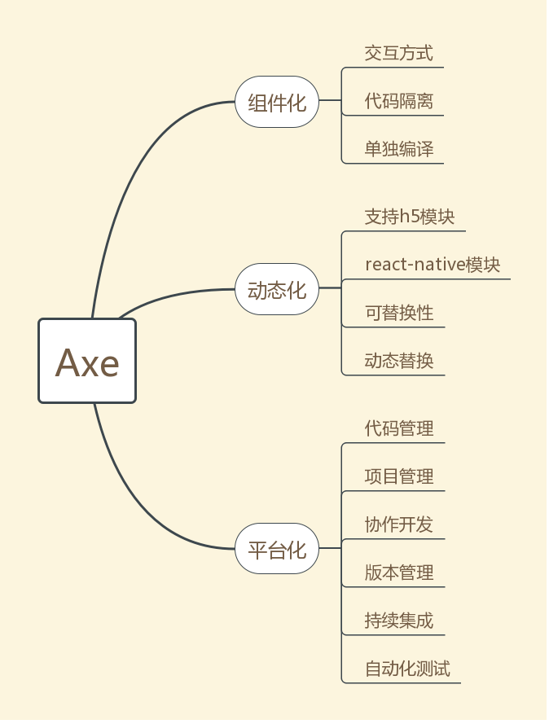
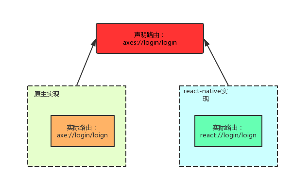

# Axe

Axe is all the reinforcement this army needs.

## Axe 框架

`Axe`是一个iOS的业务组件化框架，通过三大基础组件，来规定所有业务组件之间的交互方式， 三大基础组件为 ： 

* Router : 路由模块，根据URL获取界面或者进行跳转
* Event : 事件通知， 是业务组件之间的主要交互方式
* Data :  公共数据，以及业务组件之前传递数据的媒介

相对于一般的组件化方案，我们多了一个`Event`和`Data`, 这两个组件的出现，使跨语言的统一业务开发模式的统一成为了可能 ，即当我们规定好三种路由、事件和数据后，`h5`的模块和`react-native`的模块可以和原生模块一样通过`Axe`框架与其他业务模块进行交互。

## 示例

详细示例可以参考[Demo项目](https://github.com/axe-org/demo-app) , 这里简单介绍一下常用方法：
	
	// 路由
	// 路由跳转
	[self jumpTo:@"axes://login/register"];
	// 视图路由
	UIViewController *controller = [[AXERouter sharedRouter] viewForURL:item.viewRoute
		 withParams:data finishBlock:nil];
	// 带参数， 带回调
	AXEData *data = [AXEData dataForTransmission];
	[data setData:@"12345678" forKey:@"account"];
	[self jumpTo:@"axes://login/login" withParams:data finishBlock:^(AXEData *payload) {
	    id<LoginUserInfo> userInfo = [payload modelForKey:@"userInfo"];
	    NSLog(@"%@",userInfo.account);
	}];
	    
	//数据共享
	// 设置数据
	UIImage *image = [info objectForKey:UIImagePickerControllerOriginalImage];
	[[AXEData sharedData] setData:image forKey:@"image"];
    // 读取数据
	 UIImage *image = [[AXEData sharedData] imageForKey:@"image"];
	 
	// 事件通知
	// 注册
	[wself registerUIEvent:@"LoginStatusChange" withHandler:^(AXEData *payload) {
		BOOL login = [payload boolForKey:@"login"];
		if (!login) {
			[wself toastMessage:@"退出登录 ！！！"];
		} else {
			id<LoginUserInfo> userInfo = [payload modelForKey:@"userInfo"];
			NSLog(@"%@",userInfo.account);
		}
	}];
	// 发送通知
	[[AXEData sharedData] removeDataForKey:@"userInfo"];
	AXEData *data = [AXEData dataForTransmission];
	[data setBool:NO forKey:@"login"];
	[AXEEvent postEventName:@"LoginStatusChange" withPayload:data];
         
 
	

## Axe框架结构
 
 核心功能：
 
* Router ： 路由， 根据一个`URL`返回一次页面跳转或者一个界面
* Event  ： 事件通知 
* Data ： 数据， 既可以作为 路由跳转和事件通知的数据传递媒介，也可以做公共数据的共享

扩展功能：

* TabbarController ： TabbarController 管理的简单实现
* JavascriptSupport : 三大基础组件为支持js调用，所做的简单封装，动态性支持。
* Html ：提供webview支持，动态性支持。
* React ： 提供react-native支持，动态性支持。
* OfflineHtml ： h5离线包支持，动态性支持。
* OfflineReact : react-native 离线包支持，动态性支持。
* DynamicRouter ： 动态路由，实现完全脱离实现细节的 路由控制。，动态性支持。

## Axe系统

`Axe`框架是一个组件化的框架，而`Axe`系统是基于`Axe`框架搭建起来的完整的业务模块化管理开发系统。 所以 从`Axe`框架 到系统，分为以下三个层次 ：

* 组件化： 实现业务组件化拆分，实现代码隔离的单独编译
* 动态化： 接入`html` 和`react-native`支持， 同时模块可替换。
* 平台化： 为APP上的业务模块开发提供一个管理平台，管理开发流程。

## Axe的动态化

动态化指 尽可能地提高`APP`的动态性能力。 已知目前在`iOS`上能用的动态化方案，有两种, `H5`和`react-native` （忽略weex等），则动态化要做到的内容是 ： 支持`h5`和`react-native`模块， 使两种模块表现与原生模块相同， 最后做到能够动态切换。

#### 接入h5和react-native

我们为`axe`提供了两个接口 ：

* [axe-js](https://github.com/axe-org/axe-js) ： `h5`使用的`axe`接口
* [axe-react](https://github.com/axe-org/axe-react) ： `react-native`使用的`axe`接口

通过这两个接口，使`js`开发的业务模块也纳入了 组件化的体系中，保持与原生业务模块的一致性， 即一个原生开发的模块，与`js`开发的模块，几乎没有区别。

同时，我们为`js`开发的模块提供了离线包功能， 以优化其更新下载过程 ：

* [offline-pack-server](https://github.com/axe-org/offline-pack-server) ： 离线包管理平台
* [offline-pack-ios](https://github.com/axe-org/offline-pack-ios) ： 离线包的iOS 实现。

在`axe`框架的扩展中，`JavascriptSupport` ,`Html`, `React`,`OfflineHtml`,`OfflineReact` ,都是为`js`模块服务的。

#### 可替换性与动态切换

如上所述， 我们说`js`开发的模块接入了组件化体系， 通过提供`接口`（路由、事件、通知） 供其他模块调用，以及通过`接口`调用其他模块。 所以在我们`Axe`的组件化下， `js`模块与原生模块表现一致，可以互相替换。

动态切换：指当前APP上如果有一个业务模块的多个实现时， 我们可以控制模块选取具体的实现。

一个模块的多个实现，其接口中， 事件和通知都是相同，不同的是`路由` 。 所以我们提出了`声明路由`和`实现路由`的概念：

当APP需要这种动态化能力时， 我们开发模块时会隐藏`实现路由` ，而暴露`声明路由` ， 再通过一个下发路由映射规则的服务 ：

[dynamic-router-server](https://github.com/axe-org/dynamic-router-server)

做到线上模块动态切换。 

## Axe的平台化

平台化指通过一个平台，来规范模块化APP的开发、构建、测试、接入、发布流程，优化跨小组、团队、部门的协作开发。平台化关注以下问题：

* 代码管理的规范： 确定`git-flow`， 确定代码检视规则，确定代码提交权限 等等。
* 项目管理的规范： 确定项目时间， 明确测试与发布时间，约定需求接收模式，明确职责划分 等等 
* 协作开发的规范： 模块相关信息与接口API的展示，模块版本变更记录， 协作开发时处理模块间的依赖 等等。
* 版本管理的规范： APP的版本规则， 模块版本的规则， 版本如何发布，模块如何接入到APP中 等等。
* 持续集成的规范： 确定构建工具，搭建持续集成平台，管理模块和APP的打包  等等。
* 自动化测试：    确定自动化测试的工具与方式，完成自动化测试系统的搭建， 确保每个模块都进行自动化测试。

`Axe`系统提供一个平台化的解决方案 [axe-admin](https://github.com/axe-org/axe-admin) , 提供[demo](https://demo.axe-org.cn)以查看效果。

### License

Axe is licensed under [The MIT License](LICENSE).